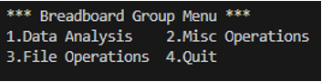

#  Bread board

- [1. Overview](#1-overview)
- [2. Define activation menus](#2-define-activation-menus)
  - [2.1. Group menu](#21-group-menu)
    - [__init__(self)](#initself)
    - [group\_selection\_menu(self)](#group_selection_menuself)
    - [2.1.1. About lambda](#211-about-lambda)
  - [2.2. Submenus](#22-submenus)
    - [__init__(self).](#initself-1)
- [3. ChatGPT](#3-chatgpt)
- [4. Miscellanea](#4-miscellanea)


## 1. Overview

The bread_board folder contains experimental code that does not fit in current
project organization. We'll keep the examples here until a final location is
determined.

## 2. Define activation menus

The steps to create menus are a bit cumbersome and interrelated. Also, we are
going to use decision tables and not switch statements. The best way to
demonstrate this is via an example by using the **bread_board
group** in the *bread_board folder*.  

### 2.1. Group menu 

The main menu is created by the [main.py](main.py) file, that is the main
activation code for the *bread-board* **folder** that contains all the
example code for this area. Next we highlight the main steps. 

#### __init__(self)

1. Define the entries of the group menu.

      ``` python
      
         self.menu_items = ["Data Analysis", "Misc Operations", 
         "File Operations", "Quit"]
      
      ```

1. Initialize group menu name and options through the `ConsoleMenu` parent class

      ``` python

         super().__init__("Breadboard Group Menu", self.menu_items)
      
      ```

      This generates the followng menu:

      

1. Instantiate the `BreadboardSubMenus` class.  It contains the submenus and the
logic to allow the user to select to desired sample.  

      ``` python
      
         _amenu = _menu.BreadboardSubMenus()
      
      ```

1. Define the sub menus decision table or dictionary.

      ``` python
      
         self.sub_menu = {
            1:  lambda: _amenu.breadboard_selection_menu(1),
            2:  lambda: _amenu.breadboard_selection_menu(2),
            3:  lambda: _amenu.breadboard_selection_menu(3)
         }
      
      ```

   The previous `sub_menu` is a dictionary of key, value pairs.  The key is an
   integer (from 1 to 3), the value is a `lambda` function which calls the
   `breadboard_selection_menu` menthod in the `BreadboardSubMenus` class and
   passes to it an integer (from 1 to 3) selected by the user and shown in this
   call `self.sub_menu[choice]()`. 

#### group_selection_menu(self)

1. Display the group menu by calling `display_menu()` method in the
   `ConsoleMenu` parent class. 
1. Loop to get the user's choice by calling `get_user_choice()` method in the
   `ConsoleMenu`.
1. If the user select `Quit` terminate the loop, otherwise display the submenus
   selected by the user.
  
#### 2.1.1. About lambda

In Python, `lambda` is a keyword that is used to define small, anonymous
functions. The `lambda function can take any number of arguments, but can only
have one expression.  

Notice the syntax `self.sub_menu[choice]()` with parenthesis `()`, allows the
`lambda` function evaluation, that is the call to `breadboard_selection_menu`
menthod, only when the dictionary entry is selected by the user and not at the
time the dictionary is created.


### 2.2. Submenus 

After the creation of the group menu, we can start creating submenus.  Each
submenu is activated by selecting one of the entries displayed in the group menu
described before. This is where the rubber hits the road. The group menus is
connected to the submenus whose entries in turn are connected toe the functions
(samples) to run. The key is the `class BreadboardSubMenus(ConsoleMenu)`.
Next we highlight the main steps. 

#### __init__(self). 

This function initializes the class `BreadboardSubMenus` instance.

1. Define the menu entries for each sample group. 

   1. Temperature menu items

      ``` python
         self.temp_menu_items = ["Plot annual temp", "Plot annual temp histogram", 
         "Quit"]
      ```  

   1. File operations menu items

      ``` python
        self.temp_hist_menu_items = ["Bulk add xsl column", "Bulk create files", 
        "Bulk nerge files", "Bulk merge xls files", "Quit"]
      ```

   1. Misc menu items

      ``` python
         self.misc_menu_items = ["Fibonacci", "Plot", "Numbers", "Quit"]
      ```

1. Group of all the sample menus. 
   The order must match the order of the `self.menu_items` list in `main.py`. 

      ``` python
        self.sub_menus = [
            [], # Leave it empty to match dictionary keys.
            self.temp_menu_items,
            self.misc_menu_items,
            self.temp_hist_menu_items,
      ```      

1. Define the instance for each sample class. 

   1. `DataAnalysisSamples` instance

      ``` python
         self.data_analysis_samples_instance = DataAnalysisSamples()
      ```  

   1. `MiscellaneaSamples` instance

      ```python
        self.misc_samples_instance = MiscellaneaSamples()
      ```  

1. Define the decision table for each sample group.  

      Each table (dictionary) entry contains a key, value pair.  The key is an
      integer, the value is the name of the sample and the method to call.  Note
      the use of the `lambda' function needed to pass parameters to the function to
      call, when needed. 

      ``` python
         self.data_analysis_samples = {
               1: ["\n***  Plot annual temperature ***", 
               self.data_analysis_samples_instance.plot_annual_temp],
               2: ["\n***  Plot annual temperature histogram ***", 
               self.data_analysis_samples_instance.plot_annual_temp_histogram],
         }

         self.misc_samples = {
               1: ["\n***  Calculate Fibonacci ***", lambda: self.misc_samples_instance.fiboTriangle(5)],
               2: ["\n***  Plotting ***", self.misc_samples_instance.plotting],
               3: ["\n***  Number Types ***", self.misc_samples_instance.getNumberTypes],
         }
      ```

1. Group of all the samples

   ``` python
        self.sample_groups = {
            1: ["Data Analysis Samples", self.data_analysis_samples],
            2: ["Misc Samples", self.misc_samples],
            3: ["File Samples", self.temp_hist_menu_items],
        }
   ```


## 3. ChatGPT

The examples in the **gpt** folder use
[ChatGPT](https://openai.com/blog/chatgpt), a powerful AI language model, to
generate Python code without any prior experience in programming. The examples
are based on the Udemy class [Make Python Programs with ChatGPT with Zero Coding
Skills](https://www.udemy.com/course/turn-ideas-into-python-programs-with-chatgpt/).
To learn how to write good *ChatGPT* queries that generate Python code, you need
to use the class.  

The class  is divided into five sections, each of which focuses on a different
aspect of using ChatGPT to build Python automations and apps.

1. In the first section, you'll learn how to sign up for ChatGPT and install the
   required Python tools to execute the generated code.
1. In the following sections, you'll dive into using ChatGPT to generate Python
   scripts that automate things, analyze and visualize data, and build web apps
   and desktop GUI apps.

This is the perfect class for anyone who wants to learn how to generate Python
code using *ChatGPT* and bring their ideas to life.

## 4. Miscellanea

The examples in the misc folder do not fit in any organization yet.
folder do not fit in any organization yet.


