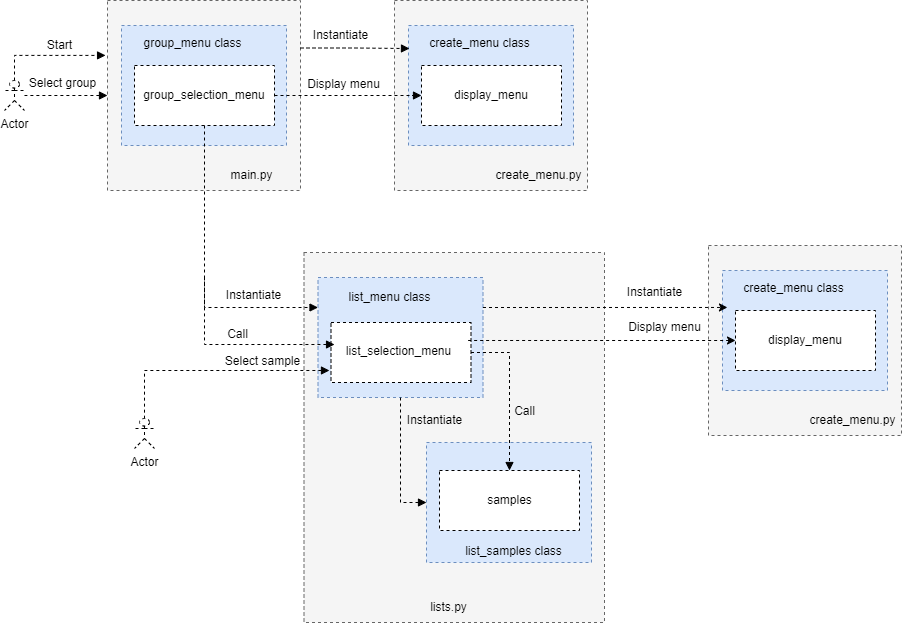

#  Language builtin types

- [1. Overview](#1-overview)
- [2. Sequence types](#2-sequence-types)
- [3. Mapping types](#3-mapping-types)
- [4. Set types](#4-set-types)
- [5. Examples](#5-examples)
- [6. References](#6-references)

## 1. Overview 

The **examples** in this folder show the use of Python builtin types and their
meaning.  When choosing a builtin type, it is useful to understand the
properties of that type.  Choosing the right type for a particular data set
could mean retention of meaning, and, it could mean an increase in efficiency or
security.

The following figure shows the code involved in selecting a sample to run by the
user. For simplicity, the figure shows only the selection of the list samples. 

 

## 2. Sequence types

There are three basic sequence types: **lists**, **tuples**, and **range** objects.
Additional sequence types also exist that are tailored for processing of binary
data and text strings.

1. **List**. Lists are **mutable sequences**, typically used to store
collections of **homogeneous items** (where the precise degree of similarity
will vary by application). It is **ordered** and **mutable** and allows
**duplicate members**. For more information, see
[lists](https://docs.python.org/3/library/stdtypes.html#lists) and [more on
lists](https://docs.python.org/3/tutorial/datastructures.html?highlight=comprehension#more-on-lists).

1. **Tuple**. Tuples are **immutable sequences**, typically used to store
collections of **heterogeneous items** (such as the 2-tuples produced by the
enumerate() built-in). Tuples are also used for cases where an immutable
sequence of homogeneous data is needed (such as allowing storage in a set or
dict instance). A tuple is **ordered** and **unmutable** and allows **duplicate
members**. For more information, see
[tuples](https://docs.python.org/3/library/stdtypes.html#tuples) and [tuples and
sequences](https://docs.python.org/3/tutorial/datastructures.html?highlight=comprehension#tuples-and-sequences).

1. **Range**.  The range type represents an **immutable sequence of numbers** and
is commonly used for looping a specific number of times **in for loops**.  For
more information, see
[ranges](https://docs.python.org/3/library/stdtypes.html#ranges).

## 3. Mapping types

**Dictionary**. Dictionaries, unlike sequences which are
indexed by a range of numbers, are indexed by keys, which can be
**any immutable type** such as **strings** and **numbers**.  
A dictionary is **ordered** and **mutable**. It **does not allow duplicate
members**. For more information, see [mapping types —
dict](https://docs.python.org/3/library/stdtypes.html#mapping-types-dict) and
[dictionaries](https://docs.python.org/3/tutorial/datastructures.html?highlight=comprehension#dictionaries).

## 4. Set types

**Set**. A set object is an unordered collection of distinct
[hashable](../../documentation/glossary.md#hashable) objects.  Common uses
include membership testing, removing duplicates from a sequence, and computing
mathematical operations such as intersection, union, difference, and symmetric
difference.  A set is **unordered**, **unmutable**, and **unindexed**. It **does
not allow duplicate members**. For more information, see [set types — set,
frozenset](https://docs.python.org/3/library/stdtypes.html#set-types-set-frozenset)
and
[sets](https://docs.python.org/3/tutorial/datastructures.html?highlight=comprehension#sets). 

|Builtin type      |Ordered|Mutable   |Duplicates|Indexed|
|------------------|-------|----------|----------|-------|
|List              | Yes   | Yes      | Yes      | Yes   |
|Tuple             | Yes   | No       | Yes      | Yes   |
|Range             |       |          |          |       |
|Set               | No    | No       | No       | No    |
|Dictionary        | Yes   | Yes      | No       | Yes   |
||||||

> [!NOTE] Set items are unchangeable, but you can remove and/or add items
> whenever you like.  As of Python version 3.7, dictionaries are ordered. In
> Python 3.6 and earlier, dictionaries are unordered.

## 5. Examples 

The following are collections related examples.

|Module                                      |Notes                                 |  
|--------------------------------------------|--------------------------------------|
| [lists.py](lists.py)                       |Examples showing the use of list      | 
| [dictionaries.py](dictionaries.py)         |Examples showing the use of dicitonary| 
|                                            |                                      |

## 6. References

- [Python 3.11.1 documentation](https://docs.python.org/3/)
  - [The Python Standard Library](https://docs.python.org/3/library/index.html#the-python-standard-library)
- [lists](https://docs.python.org/3/library/stdtypes.html#lists)
  - [more on lists](https://docs.python.org/3/tutorial/datastructures.html?highlight=comprehension#more-on-lists)
- [tuples](https://docs.python.org/3/library/stdtypes.html#tuples)
  - [tuples and sequences](https://docs.python.org/3/tutorial/datastructures.html?highlight=comprehension#tuples-and-sequences)
- [ranges](https://docs.python.org/3/library/stdtypes.html#ranges)
- [mapping types — dict](https://docs.python.org/3/library/stdtypes.html#mapping-types-dict)
  - [dictionaries](https://docs.python.org/3/tutorial/datastructures.html?highlight=comprehension#dictionaries)
- [set types — set, frozenset](https://docs.python.org/3/library/stdtypes.html#set-types-set-frozenset)
  - [sets](https://docs.python.org/3/tutorial/datastructures.html?highlight=comprehension#sets)
