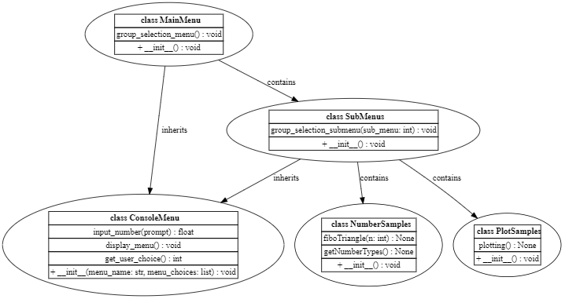
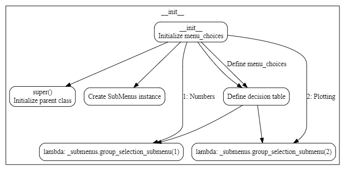
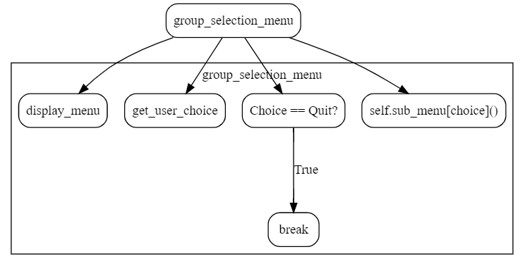
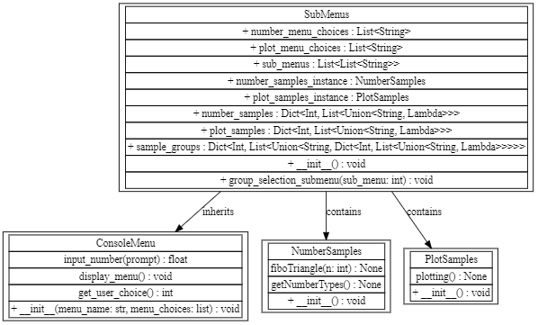
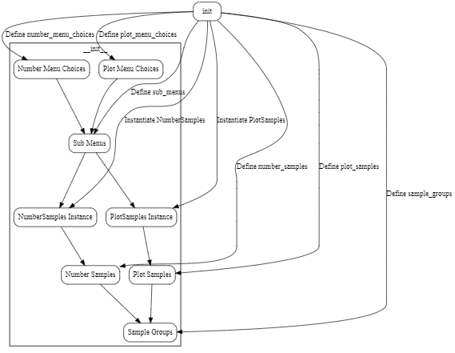
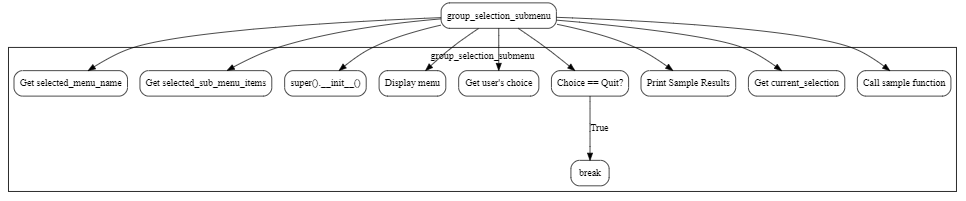

#  Console menus creation 

- [1. Overview](#1-overview)
- [2. Main menu](#2-main-menu)
  - [2.1.  MainMenu class](#21--mainmenu-class)
    - [2.1.1. \_\_init\_\_(self)](#211-__init__self)
    - [2.1.2. group\_selection\_menu(self)](#212-group_selection_menuself)
    - [2.1.3. About lambda](#213-about-lambda)
  - [2.2. SubMenus class](#22-submenus-class)
    - [2.2.1. \_\_init\_\_(self)](#221-__init__self)
    - [2.2.2. group\_selection\_submenu(self, sub\_menu)](#222-group_selection_submenuself-sub_menu)

## 1. Overview

The `menus_creation` folder contains a complete example on how to create a console
menu and submenus to select and execute code sample from a terminal windows.  
> [!NOTE] You can use the example as a template for the creation od your own
> menus and submenus. Below are the steps you cna follow.

The `menus_creation` is the main folder that contains the code to create the
main menus along with the samples to run. Specifically:

 1. The `main.py` allows for the creation of the main menu. This menu allows the
    user to select any of several group submenus.
 2. The `number_play` is the folder that contains number related samples.
 3. The `plotting_away` is folder that contains plotting related samples.  
 4. The  `submenus.py`  contains the class `SubMenus` that creates the various
    group menus (submenus).  The class instance method `group_selection_submenu`
    displays a menu of available samples, for the user's selected group, and
    allows the user to select a sample to execute from that group.

## 2. Main menu

The steps to create menus are a bit cumbersome and interrelated. Also, we are
going to use decision tables and not switch statements. The best way to
demonstrate this is via an example by using the **Main Menu** in
the `menus_creation` folder.  

### 2.1.  MainMenu class

The main menu is created by the [mainmenu.py](mainmenu.py) file.  This is done
in the `class MainMenu(ConsoleMenu)` where the main activation code is for the
`menus_creation` **folder** which contains all the examples for this area.

The following figure shows the `MainMenu` class context diagram. 



The `MainMenu` is a specialized class for creating and interacting with menus in
the console. It utilizes the functionalities provided by the `ConsoleMenu` class
and collaborates with the `SubMenus`, `NumberSamples`, and `PlotSamples` classes
to offer a comprehensive console menu system with different sample groups.

- **Attributes**
  
  - `menu_choices`. A list of strings representing the menu choices for
the main menu.  

- **Methods** 

  - `group_selection_menu()`. A method that displays the group menu and starts an endless loop. 
   It waits for the user's input and displays the submenu based on the user's selection. 
   The loop ends when the user enters the quit request.  
  - `__init__()`. The constructor that initializes the `menu_choices` attribute with 
   the main menu choices. It also initializes the main menu name and menu choices via 
   the `ConsoleMenu` parent class. Additionally, it defines the decision table to select the submenus.  
   The `MainMenu` class inherits from the `ConsoleMenu` class, which provides other methods like `input_number`,
   `display_menu`, and `get_user_choice`.

Finally, the `MainMenu` class contains an instance of the `SubMenus` class, which provides
the `group_selection_submenu` method. The `SubMenus` class, in turn, inherits from
the `ConsoleMenu` class and contains instances of the `NumberSamples` and
`PlotSamples` classes, which provide specific functionalities like calculating
Fibonacci, getting number types, and plotting.

Below, we highlight the class main functionality.

#### 2.1.1. \_\_init\_\_(self)



1. Define the choices of the main menu. Every choice represents a group of
   samplea.

      ``` python
        self.menu_choices = ["Numbers", "Plotting", "Quit"]
      ```

2. Initialize menu name and choices through the `ConsoleMenu` parent class

      ``` python

         super().__init__("Main Menu", self.menu_choices)
      
      ```

      This generates the followng menu:

      

3. Instantiate the `SubMenus` class.  It contains the submenus and the
logic to allow the user to select the desired sample.  

      ``` python
      
         _amenu = _menu.BreadboardSubMenus()
      
      ```

1. Define the decision table to select the submenus.  The order must match the
order of the `self.sub_menus`  list in `code/menus_creation/submenus.py`.  

      ``` python
      
          self.sub_menu = {
            1:  lambda: _submenus.group_selection_submenu(1), # Numbers
            2:  lambda: _submenus.group_selection_submenu(2), # Plotting 
        }
      
      ```

   The previous `sub_menu` is a dictionary of key, value pairs.  The key is an
   integer (from 1 to 2), the value is a `lambda` function which calls the
   `group_selection_menu` menthod in the `SubMenus` class and
   passes to it an integer (from 1 to 2) selected by the user and shown in this
   call `self.sub_menu[choice]()`. 

#### 2.1.2. group_selection_menu(self)



1. Display the group menu by calling `display_menu()` method in the
   `ConsoleMenu` parent class. 
1. Loop to get the user's choice by calling `get_user_choice()` method in the
   `ConsoleMenu`.
1. If the user select `Quit` terminate the loop, otherwise display the submenu
   selected by the user.
  
#### 2.1.3. About lambda

In Python, `lambda` is a keyword that is used to define small, anonymous
functions. The `lambda function can take any number of arguments, but can only
have one expression.  

Notice the syntax `self.sub_menu[choice]()` with parenthesis `()`, allows the
`lambda` function evaluation, that is the call to `group_selection_menu`
menthod, only when the dictionary entry is selected by the user and not at the
time the dictionary is created.


### 2.2. SubMenus class 

After the creation of the main menu, we can start creating submenus.  Each
submenu is activated by selecting one of the entries displayed in the group menu
described before. This is where the rubber hits the road. The main menu is
connected to the submenus whose entries in turn are connected to the functions
(samples) to run. This is done in the `class SubMenus(ConsoleMenu)`.


The following figure shows the `SubMenus` class context diagram. 



The `SubMenus` class inherits from the `ConsoleMenu` class, which provides other
methods like `input_number`, `display_menu`, and `get_user_choice`. It collaborates
with the `NumberSamples` and `PlotSamples` classes to offer specific functionalities
for the "Numbers" and "Plotting" group of samples.

- **Attributes**
  
  - `number_menu_choices`. A list of strings representing the menu choices for the
"Numbers" group menu.  
  - `plot_menu_choices`. A list of strings representing the menu choices for the
"Plotting" group menu.  
  - `sub_menus`. A list containing two lists, which represent the group of all
sample menus. The first list is left empty to match dictionary keys, and the
second list contains the `number_menu_choices` and `plot_menu_choices`.  
  - `number_samples_instance`. An instance of the `NumberSamples` class, which
provides specific functionalities for the "Numbers" group of samples.  
  - `plot_samples_instance`. An instance of the PlotSamples class, which provides
specific functionalities for the "Plotting" group of samples.  
  - `number_samples`. A dictionary containing the decision table for the "Numbers"
group of samples. Each entry contains the name of the sample and the method to
call. The method is represented as a `lambda` function to pass parameters to the
function when needed.  
  - `plot_samples`. A dictionary containing the decision table for the "Plotting"
group of samples. Each entry contains the name of the sample and the method to
call.  
  - `sample_groups`. A dictionary containing all the sample groups' decision
tables. Each entry represents a sample group and contains the group's name and
its respective decision table.

- **Methods**
  
  - `group_selection_submenu(sub_menu)`. A method that displays a menu of
available samples for the user's selected group and allows the user to select a
sample to execute from that group. It processes the user's input and calls the
proper sample method based on the user's selection.  
  - `__init__()`. The constructor that initializes the menu choices for each
sample group, instantiates each sample class (NumberSamples and PlotSamples),
and defines the decision tables for each sample group. It groups all the
samples' decision tables together.


#### 2.2.1. \_\_init\_\_(self) 



1. Define the menu entries for each sample group. 

   1. Choices for the Numbers group menu

      ``` python
            self.number_menu_choices = ["Fibonacci", "Numbers", "Quit"]
      ```  

   1. Choices for the Plot group menu

      ``` python
            self.plot_menu_choices = ["Plot", "Quit"]
      ```

2. Group all the sample menus. 
   The order must match the order of the `self.menu_items` list in
   `code/menus_creation/main.py`.  

      ``` python
         self.sub_menus = [
               [], # Leave it empty to match dictionary keys.
                  # This is because the start key is 1 in the related
                  # selection table (dictionary) `sub_menu` defined 
                  # in main.py.   
               self.number_menu_choices, # Value associated with key 1 
               self.plot_menu_choices    # Value associated with key 2 
        ]
        
      ```

3. Instantiate each sample class. 

   1. `NumberSamples` instance

      ``` python
            self.number_samples_instance = NumberSamples()
      ```  

   2. `PlotSamples` instance

      ```python
           self.plot_samples_instance = PlotSamples()
      ```  

4. Define the decision table for each sample group.  

      Each table (dictionary) entry contains a key, value pair.  The key is an
      integer, the value is the sample instance and the method to call.  Note
      the use of the `lambda' function needed to pass parameters to the function to
      call, when needed. 

      1. `Numbers` selection decision table

      ``` python

           self.number_samples = {
            1: ["\n***  Calculate Fibonacci ***", lambda: self.number_samples_instance.fiboTriangle(5)],
            2: ["\n***  Get number types ***", self.number_samples_instance.getNumberTypes],
        }
        
      ```

      1. `Plot` selection decision table

      ``` python

          self.plot_samples = {
            1: ["\n***  Plotting ***", self.plot_samples_instance.plotting],
        }

      ```

5. Group of all the sample decision tables

   ``` python

       self.sample_groups = {
            1: ["Numbers Samples", self.number_samples],
            2: ["Plot Samples", self.plot_samples]
        }

   ```

#### 2.2.2. group_selection_submenu(self, sub_menu)



1. Get the name of the sub menu selected by the user.

   ``` python

         selected_menu_name = self.sample_groups[sub_menu][0]
   ```

2. Get the selected sub menu.

   ``` python

         selected_sub_menu_items = self.sub_menus[sub_menu]
   ```

3. Initialize selected menu name and items through `ConsoleMenu` parent class.  

   ``` python

         super().__init__(selected_menu_name, selected_sub_menu_items)
   ```

4. Display the menu.

   ``` python

         self.display_menu()
   ```

5. Get the user's choice.

   ``` python

         choice = self.get_user_choice()
   ```

6. Get the selected list

   ``` python

         _current_selection = self.sample_groups[sub_menu][1] 
   ```

7. Call the selectd sample function.

   ``` python

         _current_selection[int(choice)][1]()
   ```